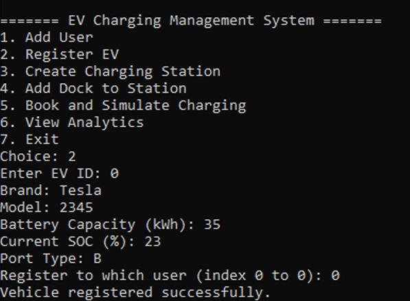

# Smart EV Charging Network Simulation

A city-scale Smart Electric Vehicle (EV) Charging Network Simulation built in C++ using Object-Oriented Programming principles.

This project models a real-world EV charging infrastructure including users, vehicles, charging stations, energy management, dynamic pricing, load balancing, analytics, and billing.

---

## 1. Project Overview

With the rapid growth of electric vehicles, efficient and scalable charging infrastructure is essential. This project simulates a smart EV charging ecosystem that:

- Manages users and their EVs
- Allows booking charging time slots
- Simulates charging stations with multiple docks
- Uses solar and grid energy intelligently
- Implements dynamic pricing
- Prevents overload through load balancing
- Generates invoices
- Tracks system analytics

The system is modular, scalable, and designed using clean OOP architecture.

---

## 2. Problem Statement

The objective was to design and simulate a city-wide EV charging network capable of:

- Handling multiple users and vehicles
- Managing bookings and dock availability
- Optimizing energy usage (Solar + Grid)
- Preventing station overload
- Calculating dynamic pricing
- Generating invoices
- Providing analytics insights

---

## 3. System Architecture

### Core Classes

| Class | Responsibility |
|-------|---------------|
| `User` | Manages customer information and EV registrations |
| `EV` | Represents an electric vehicle |
| `ChargingStation` | Contains multiple charging docks |
| `ChargingDock` | Individual charging port |
| `Booking` | Handles charging session scheduling |
| `EnergySource` | Abstract base class for energy providers |
| `SolarPower` | Renewable energy source |
| `GridPower` | Traditional energy source |
| `PricingEngine` | Calculates dynamic charging cost |
| `Invoice` | Generates billing details |
| `LoadBalancer` | Prevents system overload |
| `AnalyticsEngine` | Tracks system performance metrics |
| `NotificationManager` | Simulates system alerts |

---

## 4. Charging Workflow

1. User selects EV, station, and time slot.
2. System checks dock availability.
3. Booking is created and dock is reserved.
4. Charging begins:
   - Solar power is used first.
   - Grid power is used if solar is insufficient.
5. Energy consumption is recorded.
6. Pricing engine calculates cost.
7. Invoice is generated.
8. Analytics data is updated.

---

## 5. Key Features

### Object-Oriented Design
- Encapsulation
- Inheritance
- Polymorphism
- Abstraction

### Polymorphism
`EnergySource` acts as a base class for:
- `SolarPower`
- `GridPower`

This allows flexible switching between energy sources without modifying core logic.

### Memory Management
- Uses `std::unique_ptr`
- Prevents memory leaks
- Ensures safe ownership handling

### Dynamic Pricing Based On
- Charging speed (FAST / SLOW)
- Time of day (PEAK / OFF-PEAK)
- Membership level (PREMIUM / SILVER / NONE)
- Energy source used
- Usage-based surcharges

### Load Balancing
- Prevents station overload
- Fair energy distribution
- Maintains system stability during peak demand

---

## 6. Screenshots

## 6.1 User Registration

---

## 6.2 EV Registration

---

## 6.3 Create Charging Station

---

## 6.4 Add Dock to Station

---

## 6.5 Booking Screen

---

## 6.6 Notifications

---

## 6.7 Invoice Generation

---

## 6.8 Analytics Dashboard

---

## 6.9 Exit Screen

---

## 7. Technologies Used

- C++
- Object-Oriented Programming
- Standard Template Library (STL)
- Console-based simulation

---
